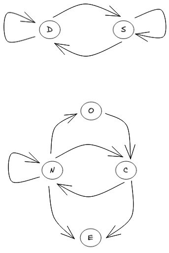

# EDS

EDS parser

```
ATCGATGGG{T,C}AACTT{T,G}AG{G,T}CCGGTTTATATTGAT{T,C}CCTA{T,G}{T,A}{A,T}A{T,A}GGGGGTCCTTTGCTTGCTGTTG{A,G}CTC{T,G}TGAGTGAGCTTGCGAGATA
```
Parse an EDS into a DAG.



Degenerate letters are between brackets.
Individual seeds are separated by commas.

Generate EDS from fasta file and VCF
https://github.com/webmasterar/edso

Generate random EDS
https://github.com/webmasterar/EDSRand
